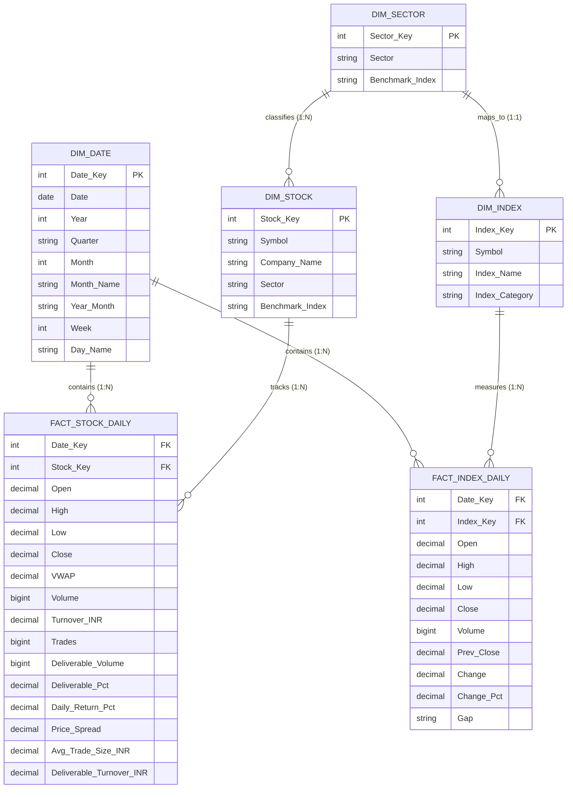

# Star Schema & Dimensional Model Documentation (Phase 6)

**Project**: Brokerage Intelligence: BI-Based Stock Trading & Market Activity Analytics  
**Course**: Business Intelligence (CIA-III)  

---

## 1. Dimensional Architecture Diagram (Mermaid)

---

## 2. Relationships & Cardinality

1. **`DIM_DATE` $\rightarrow$ `FACT_STOCK_DAILY` (1 : N)**:
   - One date in `DIM_DATE` is associated with up to 100 stock records in `FACT_STOCK_DAILY` per trading day.
   - Enforced via foreign key `FACT_STOCK_DAILY.Date_Key = DIM_DATE.Date_Key`.

2. **`DIM_DATE` $\rightarrow$ `FACT_INDEX_DAILY` (1 : N)**:
   - One date in `DIM_DATE` is associated with up to 30 index records in `FACT_INDEX_DAILY`.
   - Enforced via foreign key `FACT_INDEX_DAILY.Date_Key = DIM_DATE.Date_Key`.

3. **`DIM_STOCK` $\rightarrow$ `FACT_STOCK_DAILY` (1 : N)**:
   - One stock entity in `DIM_STOCK` has ~2,668 historical trading session rows in `FACT_STOCK_DAILY`.
   - Enforced via foreign key `FACT_STOCK_DAILY.Stock_Key = DIM_STOCK.Stock_Key`.

4. **`DIM_INDEX` $\rightarrow$ `FACT_INDEX_DAILY` (1 : N)**:
   - One index entity in `DIM_INDEX` has between 2,668 and 7,000+ daily session rows in `FACT_INDEX_DAILY`.
   - Enforced via foreign key `FACT_INDEX_DAILY.Index_Key = DIM_INDEX.Index_Key`.

5. **`DIM_STOCK` $\rightarrow$ `DIM_INDEX` (Conceptual Sector Mapping)**:
   - Stocks belong to sectors that map to specific benchmark sectoral indices (e.g., `TCS` $\rightarrow$ `Information Technology` $\rightarrow$ `CNXIT`). This enables comparative alpha calculations in Tableau.

---

## 3. Grain & Measure Classification

| Table | Grain | Additive Measures | Semi-Additive Measures | Non-Additive Measures |
| :--- | :--- | :--- | :--- | :--- |
| **`FACT_STOCK_DAILY`** | Stock × Day | `Volume`, `Turnover_INR`, `Trades`, `Deliverable_Volume`, `Deliverable_Turnover_INR`, `Price_Spread` | `Close`, `Open`, `High`, `Low`, `VWAP` (meaningful via Average/Last) | `Deliverable_Pct`, `Daily_Return_Pct`, `Avg_Trade_Size_INR` |
| **`FACT_INDEX_DAILY`** | Index × Day | `Volume`, `Change` | `Close`, `Open`, `High`, `Low`, `Prev_Close` | `Change_Pct` |
