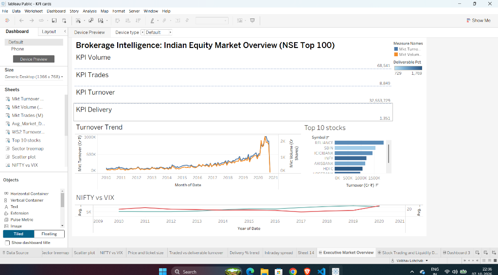
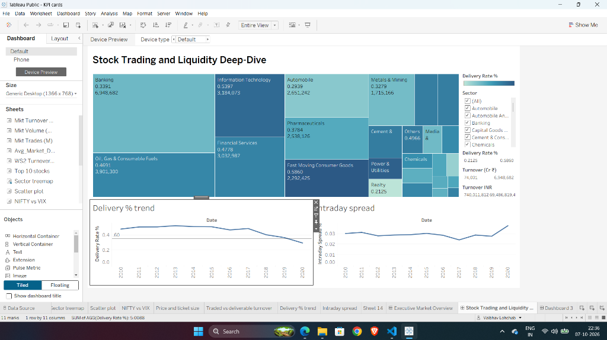
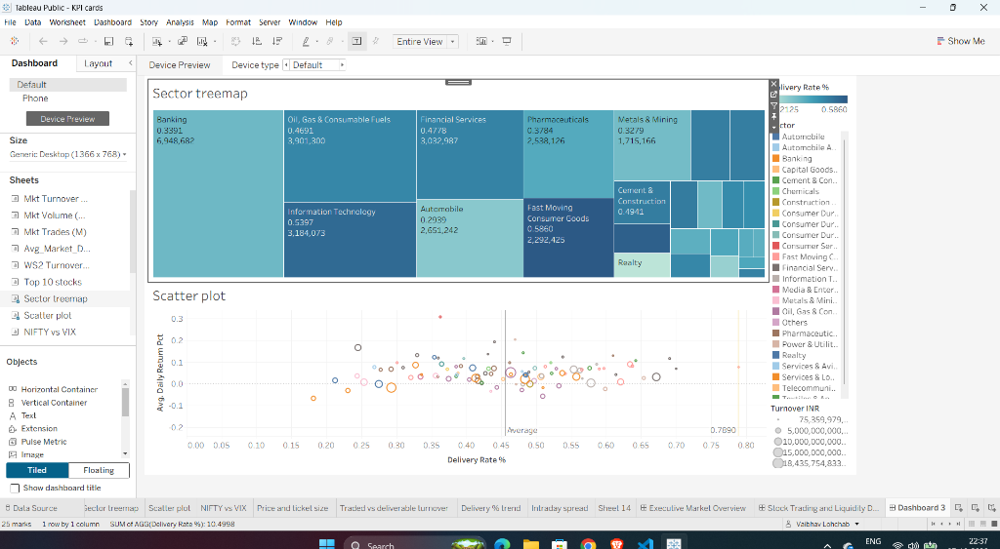

# Tableau Public Step-by-Step Dashboard Assembly Guide

**Project**: Brokerage Intelligence: BI-Based Stock Trading & Market Activity Analytics  
**Course**: Business Intelligence (CIA-III)  
**Target Platform**: Tableau Public (Desktop / Browser)  

---

## 1. Prerequisites & File Connections

1. Open **Tableau Public** application on your machine.
2. In the left **Connect** panel under **To a File**, click **Text file**.
3. Navigate to your project folder:
   ```
   c:\Projects\Brokerage Intelligence\data\tableau_ready\
   ```
4. Select and open **`tableau_stock_analytics.csv`**. This is your **Primary Data Source**.
5. In the top navigation bar, click **Data** $\rightarrow$ **New Data Source** $\rightarrow$ **Text file**.
   - Select and add **`tableau_market_summary.csv`** (This file contains pre-aggregated daily market totals, ideal for Executive KPI cards and macro trends).
6. Again, click **Data** $\rightarrow$ **New Data Source** $\rightarrow$ **Text file**.
   - Select and add **`tableau_index_analytics.csv`** (This file contains daily benchmark and sectoral index metrics).
7. Verify that all 3 data sources appear in the top-left Data pane.

---

## 2. Worksheet Construction Guide

### Worksheet 1: Macro KPI Cards (Executive Summary)
* **Data Source**: Select `tableau_market_summary.csv`
* **Card 1: Total Traded Turnover (₹ Cr)**
  - Drag `Total_Market_Turnover_INR` to **Text** in the Marks card.
  - Set Aggregation to `SUM`.
  - Right-click the pill $\rightarrow$ **Format** $\rightarrow$ Number (Custom): Units in Crores or create calculated field `[Total_Market_Turnover_INR] / 10000000`.
  - Click **Text** $\rightarrow$ Edit text: Make number **24pt Bold `#1b365d`**, add label below: `Total Traded Turnover (₹ Cr)`.
* **Card 2: Total Volume (Crore Shares)**
  - In a new sheet, drag `Total_Market_Volume` to **Text**.
  - Formula: `SUM([Total_Market_Volume]) / 10000000`.
  - Format as 24pt Bold with subtitle `Total Traded Shares (Crores)`.
* **Card 3: Total Executed Trades (Millions)**
  - Drag `Total_Market_Trades` to **Text**.
  - Formula: `SUM([Total_Market_Trades]) / 1000000`.
  - Format as 24pt Bold with subtitle `Total Trades (Millions)`.
* **Card 4: Average Delivery Ratio (%)**
  - Drag `Avg_Market_Delivery_Pct` to **Text**. Aggregation: `AVG`.
  - Format as Percentage (1 decimal place, e.g., `48.2%`).

---

### Worksheet 2: Market Turnover & Volume Trend (Dual-Axis)
* **Data Source**: `tableau_market_summary.csv`
* **Columns Shelf**: Drag `Date`. Right-click pill $\rightarrow$ Choose **Month (Continuous)** (the green month option).
* **Rows Shelf**:
  - Row 1: Drag `Total_Market_Turnover_INR`. Formula: `SUM([Total_Market_Turnover_INR]) / 10000000`.
  - Row 2: Drag `Total_Market_Volume`. Formula: `SUM([Total_Market_Volume]) / 10000000`.
* **Creating Dual Axis**:
  - Right-click the second pill on Rows (`SUM(Total_Market_Volume)...`) $\rightarrow$ Click **Dual Axis**.
  - In the Marks card, select the Turnover measure $\rightarrow$ Set Mark type to **Line** (Color: Deep Navy Blue `#1f77b4`, Size: medium).
  - Select the Volume measure $\rightarrow$ Set Mark type to **Bar** or **Area** (Color: Slate Gray `#aec7e8` with 35% opacity).
* **Formatting**:
  - Right-click left axis $\rightarrow$ Edit Title: `Turnover (₹ Crores)`.
  - Right-click right axis $\rightarrow$ Edit Title: `Volume (Crore Shares)`.
* **Sheet Title**: `Market Turnover (₹ Cr) and Traded Volume Trend (2010–2020)`.

---

### Worksheet 3: Top 10 Liquid Equities by Turnover
* **Data Source**: `tableau_stock_analytics.csv`
* **Columns Shelf**: Drag `Turnover_INR`. Set calculation to `SUM([Turnover_INR]) / 10000000`.
* **Rows Shelf**: Drag `Symbol`.
* **Sorting**: Click the sort descending icon on the toolbar so the highest turnover stock is on top.
* **Filter to Top 10**:
  - Drag `Symbol` to the **Filters** shelf.
  - In the dialog, go to the **Top** tab.
  - Select **By field** $\rightarrow$ **Top 10** by `Turnover_INR` $\rightarrow$ `Sum`. Click OK.
* **Color Encoding**:
  - Drag `Deliverable_Pct` to **Color** in the Marks card.
  - Aggregation: `AVG`.
  - Palette: Green-Orange Diverging (Green = high delivery conviction, Orange = speculative intraday churn).
* **Labels**: Check **Show mark labels** on Marks card.
* **Sheet Title**: `Top 10 Stocks by Traded Turnover & Delivery Conviction`.

---

### Worksheet 4: Sector Liquidity Treemap
* **Data Source**: `tableau_stock_analytics.csv`
* **Marks Card**: Change mark type dropdown from Automatic to **Square** (Treemap).
* **Size**: Drag `Turnover_INR` to **Size** (`SUM`).
* **Color**: Drag `Deliverable_Pct` to **Color** (`AVG`).
* **Label**: Drag `Sector`, `Turnover_INR` (`SUM`), and `Deliverable_Pct` (`AVG`) to **Label**.
* **Formatting**:
  - Format Turnover label to show ₹ Crores: `₹ <SUM(Turnover_INR)/10000000> Cr`.
  - Format Delivery label as percentage: `<AVG(Deliverable_Pct)>%`.
* **Sheet Title**: `Sectoral Capital Distribution & Delivery Ratio`.

---

### Worksheet 5: Delivery Conviction vs. Daily Return (Scatter Plot)
* **Data Source**: `tableau_stock_analytics.csv`
* **Columns Shelf (X-Axis)**: Drag `Deliverable_Pct`. Aggregation: `AVG([Deliverable_Pct]) * 100`.
* **Rows Shelf (Y-Axis)**: Drag `Daily_Return_Pct`. Aggregation: `AVG([Daily_Return_Pct])`.
* **Detail**: Drag `Symbol` and `Company_Name` to **Detail** in the Marks card.
* **Color**: Drag `Sector` to **Color**.
* **Size**: Drag `Turnover_INR` to **Size** (`SUM`).
* **Reference Lines (Quadrant Division)**:
  - Open the **Analytics** tab on the left.
  - Drag **Average Line** onto the chart $\rightarrow$ Drop on **Table** $\rightarrow$ `Deliverable_Pct`.
  - Drag **Constant Line** $\rightarrow$ Enter `0.0` for `Daily_Return_Pct`.
  - This divides the scatter into 4 quadrants:
    1. Top-Right: High Delivery + Positive Return (Institutional Conviction Leaders).
    2. Top-Left: Low Delivery + Positive Return (Speculative Momentum Gainers).
    3. Bottom-Left: Low Delivery + Negative Return (High Churn Laggards).
    4. Bottom-Right: High Delivery + Negative Return (Accumulation on Dips).
* **Sheet Title**: `Stock Trading Profile: Delivery Conviction vs. Daily Return`.

---

### Worksheet 6: Benchmark NIFTY 50 vs. INDIA VIX Volatility
* **Data Source**: `tableau_market_summary.csv`
* **Columns Shelf**: Drag `Date` (Continuous Day/Month).
* **Rows Shelf**:
  - Row 1: `AVG([NIFTY_50_Close])`
  - Row 2: `AVG([INDIA_VIX_Close])`
* **Dual Axis Setup**:
  - Right-click Row 2 pill $\rightarrow$ **Dual Axis**.
  - Row 1 Marks: Line chart (Navy Blue `#1b365d`).
  - Row 2 Marks: Line chart or Area chart (Crimson Red `#d62728`).
* **Sheet Title**: `Benchmark Trend (NIFTY 50) vs. Market Volatility (INDIA VIX)`.

---

### Worksheet 7: Stock Liquidity Deep-Dive & Ticket Size
* **Data Source**: `tableau_stock_analytics.csv`
* **Columns Shelf**: Drag `Date` (Continuous Day/Week).
* **Rows Shelf**:
  - `AVG([Close])` (Closing Price in ₹).
  - `AVG([Avg_Trade_Size_INR])` (Average Ticket Size per Trade).
* **Filter**: Drag `Symbol` to Filters $\rightarrow$ Select `RELIANCE` (or any single stock) $\rightarrow$ Right-click filter pill $\rightarrow$ **Show Filter**.
* **Sheet Title**: `Equity Price & Order Ticket Size Dynamics`.

---

## 3. Dashboard Assembly & Layout Blueprint

### Dashboard 1: Executive Market Overview
1. Click **New Dashboard** icon at the bottom.
2. In the left panel under **Size**, set to **Fixed Size** $\rightarrow$ **Generic Desktop (1366 × 768 px)**.
3. Drag a **Vertical Layout Container** into the blank canvas.
4. Add **Title Header (Horizontal Container)**:
   - Add Text object:
     `Brokerage Intelligence: Indian Equity Market Overview (NSE Top 100)`
     `Academic Business Intelligence Case Study — CIA-III`
   - Set background color to light gray `#f8f9fa` or clean white with dark borders.
5. Add **KPI Row (Horizontal Container, Height ~110px)**:
   - Place Card 1, Card 2, Card 3, Card 4 side by side.
6. Add **Main Visualization Section (Horizontal Container, Height ~380px)**:
   - Left (60%): Drag `Worksheet 2: Market Turnover & Volume Trend`.
   - Right (40%): Drag `Worksheet 3: Top 10 Liquid Equities`.
7. Add **Bottom Section (Height ~200px)**:
   - Drag `Worksheet 6: Benchmark NIFTY 50 vs. INDIA VIX Volatility`.

* **Visual Output Reference**:
  

---

### Dashboard 2: Stock Trading & Liquidity Deep-Dive
1. Create New Dashboard $\rightarrow$ Size: **1366 × 768 px**.
2. **Top Controls Bar**:
   - Add interactive filters for `Sector`, `Symbol` (Single Value Dropdown), and `Date` Range Slider.
3. **Upper Section (50% Height)**:
   - Left: `Worksheet 7: Stock Price & Ticket Size`.
   - Right: Traded Turnover vs Deliverable Turnover bar chart.
4. **Lower Section (50% Height)**:
   - Left: Delivery Percentage Trend over Time with 35% and 60% threshold bands.
   - Right: Intraday Price Spread (`High - Low`) over time.

* **Visual Output Reference**:
  

---

### Dashboard 3: Sectoral Dynamics & Market Microstructure
1. Create New Dashboard $\rightarrow$ Size: **1366 × 768 px**.
2. **Top Half (50% Height)**:
   - Drag `Worksheet 4: Sector Liquidity Treemap`.
3. **Bottom Half (50% Height)**:
   - Drag `Worksheet 5: Delivery Conviction vs. Daily Return (Scatter Plot)`.
4. **Interactive Filter Action**:
   - In top menu: **Dashboard** $\rightarrow$ **Actions...** $\rightarrow$ **Add Action** $\rightarrow$ **Filter**.
   - Name: `Filter by Sector`.
   - Source Sheet: `Sector Liquidity Treemap`.
   - Run Action On: `Select` (Click).
   - Target Sheet: `Scatter Plot`.
   - Clearing the selection will: `Show all values`.
   - Now, clicking any sector in the Treemap automatically filters the scatter plot below to that sector's constituent stocks.

* **Visual Output Reference**:
  


---

## 4. Professional Formatting & Styling Checklist

1. **Color Palette**:
   - Corporate Primary: Deep Navy `#1b365d`.
   - Delivery Conviction (Holding): Forest Green `#2ca02c`.
   - Speculative Churn (Intraday): Bright Coral `#d62728`.
   - Volume / Neutral: Slate Gray `#7f7f7f`.
2. **Fonts**:
   - Dashboard Titles: 18pt Bold.
   - Section Subheaders: 12pt Bold.
   - KPI Numbers: 22-26pt Bold.
   - Chart Labels / Axis: 9-10pt Regular.
3. **Tooltips**:
   - Format tooltips into clear English sentences:
     ```
     Company: <Symbol> (<Company_Name>)
     Sector: <Sector>
     Total Turnover: ₹<SUM(Turnover_INR)/10000000> Crores
     Delivery Ratio: <AVG(Deliverable_Pct)>%
     Average Ticket Size: ₹<AVG(Avg_Trade_Size_INR)>
     ```

---

## 5. Saving and Publishing to Tableau Public

1. In Tableau Public, click **File** $\rightarrow$ **Save to Tableau Public As...**
2. Enter your Tableau Public login credentials (create a free account at `public.tableau.com` if you do not have one).
3. Name your workbook: `Brokerage Intelligence: Stock Trading & Market Activity Analytics`.
4. Once uploaded, Tableau Public opens your dashboard in your default browser.
5. Click **Edit Details**:
   - Check **Allow others to download the workbook and its data**.
   - Add a brief description: `Academic CIA-III Business Intelligence project analyzing NSE Top 100 stocks and 30 indices (2010-2020)`.
6. Copy the published dashboard URL. Paste this live link into your CIA-III submission and report.
